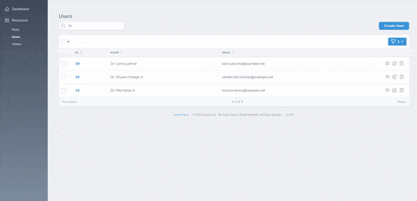

# Nova Input Filter

[](https://packagist.org/packages/optimistdigital/nova-input-filter)
[](https://packagist.org/packages/optimistdigital/nova-input-filter)

This [Laravel Nova](https://nova.laravel.com/) package allows you to create simple input filter.

## Requirements

- `php: >=7.2`
- `laravel/nova: ^3.0`

## Features

- Out of the box, works like an additional search field.
- Inline usage for simple use-cases.

## Screenshots



## Installation

Install the package in to a Laravel app that uses [Nova](https://nova.laravel.com) via composer:

```bash
composer require optimistdigital/nova-input-filter
```

## Usage

Accepts an array of columns as first parameter and filter name as second parameter. Can optionally pass in multiple
columns: `['email', 'id']`, similarly to nova's search.

```php
use OptimistDigital\NovaInputFilter\InputFilter;

public function filters(Request $request)
{
    return [
        InputFilter::make()->forColumns(['email'])->withName('Email'),
    ];
}
```

## Customizing

Out of the box, `InputFilter` works exactly like Nova's search field. If you wish to change it, you can extend
the `InputFilter` class and override `apply()` function.

```php

use OptimistDigital\NovaInputFilter\InputFilter;

class ExtendedInputFilter extends InputFilter
{
    public function apply(Request $request, $query, $search)
    {
        return $query->where('email', 'like', "%$search%");
    }
}
```

## Credits

- [Kaspar Rosin](https://github.com/kasparrosin)

## License

Nova Input Filter is open-sourced software licensed under the [MIT license](LICENSE.md).
